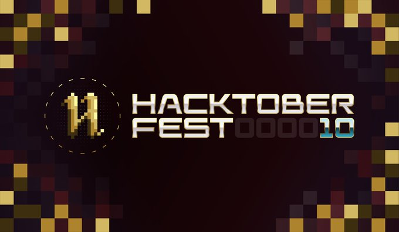

# matrix-movies-website-hacktoberfest
This repo is a fan website dedicated to The Matrix movies.  Seeking contributions from anyone wanting to participate in  Hacktoberfest 2023.

# The Matrix Movies Website, a HacktoberFest Project for Beginners 🕶️

Whether you are a coder 👨🏾‍💻 or non-coder 👩‍🎨, newbie 👶 or more experienced 👴, your contribution is welcome!

Let's build a website to celebrate The Matrix movie series.  Join the revolution! ☎️ 🪞

- 💡 If you have any ideas (feature requests) about what cool things could go on the website, please **create an issue** to describe it.
  - Example: game idea 🎮📱

- 📢 If you have some additional thoughts on any of the issues, go ahead and 🖊 share your **comment on the issue** page.

- If you have media content, it would be awesome if you upload them. 
  - Artwork 🎨 and Photos 📷 go into the img/ directory
  - Videos 🎬 go into the vid/ directory
  - Music or Audio 🎧 go into the snd/ directory

- 🕸🧑‍💻 If you have some **code** you want to contribute, either directly submit a pull request or create an issue first, so then I can assign it to you.

## Thanks in advance for your help! 😎

# Hacktoberfest Summary

Hacktoberfest is an event on GitHub or GitLab that encourages everyone to participate in open source software development.  You are tasked with making **4 or more pull requests** during the month of October.  If your pull requests are accepted, then you win digital badges.  It's a chance to learn more about git, GitHub or GitLab, and in the case of this project, more about web development, JavaScript, HTML, and CSS.

For more info:  [hacktoberfest.com](https://hacktoberfest.com/)

# License

This project is licensed under the terms of the MIT license.
