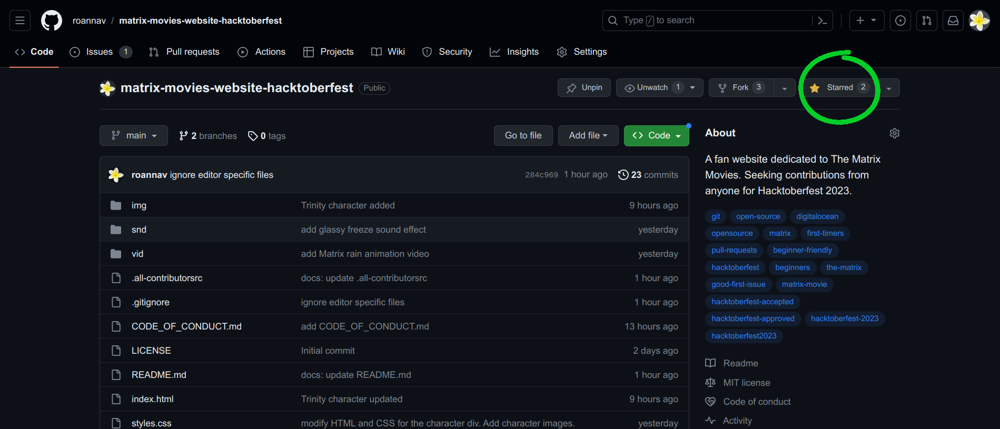
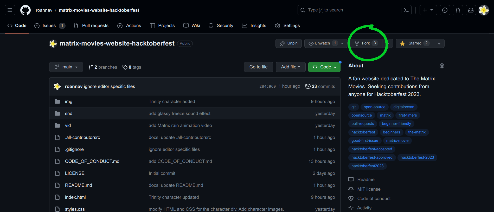
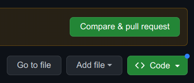

# matrix-movies-website-hacktoberfest
[](#contributors)


This repo is a fan website dedicated to The Matrix movies.  Seeking contributions from anyone wanting to participate in  Hacktoberfest 2023.


# The Matrix Movies Website, a HacktoberFest Project for Beginners 🕶️

Whether you are a coder 👨🏾‍💻 or non-coder 👩‍🎨, newbie 👶 or more experienced 👴, your contribution is welcome!

Let's build a website to celebrate The Matrix movie series.  Join the revolution! ☎️ 🪞

- 💡 If you have any ideas (feature requests) about what cool things could go on the website, please **create an issue** to describe it.
  - Examples: game idea 🎮📱
  - Adding a CSS animation or picture to the `<header>`
  - Making the links glow green
  - Writing text questions for a trivia quiz
  - Creating a Discussion Board 
  - and so on...

- 📢 If you have some additional thoughts on any of the issues, go ahead and 🖊 share your **comment on the issue** page.

- If you have media content, it would be awesome if you upload them. 
  - Artwork 🎨 and Photos 📷 go into the `img/` directory
  - Videos 🎬 go into the `vid/` directory
  - Music or Audio 🎧 go into the `snd/` directory

- 🕸🧑‍💻 If you have some **code** you want to contribute, either directly submit a pull request or create an issue first, so then we can discuss it and/or I can assign the issue to you.

## Thanks in advance for your help! 😎


# Hacktoberfest Summary

Hacktoberfest is an event on GitHub or GitLab that encourages everyone to participate in open source software development.  You are tasked with making **4 or more pull requests** during the month of October.  If your pull requests are accepted, then you win digital badges.  It's a chance to learn more about git, GitHub or GitLab, and in the case of this project, more about **web development, JavaScript, HTML, and CSS**.

For more info:  [hacktoberfest.com](https://hacktoberfest.com/)

# Getting Started

1) **Star this repository** (See top right of this page.  Click the **"Star"** button.)

    

2) **Fork this repository** (See top right of this page.  Click the **"Fork"** button.  On the next screen that appears, click the green **"Create fork"** button in the lower right.)

    

3) **Open a Terminal**, where you can enter command line text. For the next steps, you'll be using this terminal.

4) **Clone the forked repository** down to your machine:

   `git clone git@github.com:<your-username>/matrix-movies-website-hacktoberfest.git`
   
   Remember to replace `<your-username>` with your GitHub username.

5) **Go into your local repo directory**

   `cd matrix-movies-website-hacktoberfest`

6) **Create a branch**

   `git checkout -b <your-branch-name>`

   Think of a name for your new branch.  Your branch name can be anything, but it's better if it briefly describes the change you are making.  Replace `<your-branch-name>` with the branch name you've chosen.

7) **Edit your changes** in a code editor, such as VS Code.

8) **Preview your changes**

   `git status`

9) **Send your changes up to your forked repo at GitHub:  Add, commit and push**

   ```
   git add .
   git commit -m "Your commit message"
   git push -u origin <your-branch-name>
   ```

10) **Create a new pull request** from your forked repo at GitHub.  (Click on the green **"Compare & pull request"** button that is near the top of the page.)

    

11) **Wait for your PR review and merge approval**.   I will review it as soon as possible.  Thank you for your time and effort in improving this project!

12) **Celebration time!** 🎊 Your PR has been approved! You are a genuine open sourcerer! 🧙 You have unlocked the knowledge and power to make changes throughout the open source world.  What will be next?


# Contributors

<!-- ALL-CONTRIBUTORS-LIST:START - Do not remove or modify this section -->
<!-- prettier-ignore-start -->
<!-- markdownlint-disable -->
<table>
  <tbody>
    <tr>
      <td align="center" valign="top" width="14.28%"><a href="http://roannav.com"><br /><sub><b>Roanna Victorio</b></sub></a><br /><a href="#code-roannav" title="Code">💻</a> <a href="#audio-roannav" title="Audio">🔊</a> <a href="#a11y-roannav" title="Accessibility">️️️️♿️</a> <a href="#content-roannav" title="Content">🖋</a></td>
      <td align="center" valign="top" width="14.28%"><a href="https://github.com/ombhagwat2401"><br /><sub><b>Om Bhagwat</b></sub></a><br /><a href="#code-ombhagwat2401" title="Code">💻</a> <a href="#content-ombhagwat2401" title="Content">🖋</a></td>
      <td align="center" valign="top" width="14.28%"><a href="https://github.com/Naman73598"><br /><sub><b>Naman Agrahari</b></sub></a><br /><a href="#code-Naman73598" title="Code">💻</a> <a href="#content-Naman73598" title="Content">🖋</a></td>
    </tr>
  </tbody>
</table>

<!-- markdownlint-restore -->
<!-- prettier-ignore-end -->

<!-- ALL-CONTRIBUTORS-LIST:END -->

# License

This project is licensed under the terms of the MIT license.
